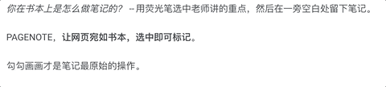

# 🏡从这里开始

### [PAGENOTE](https://pagenote.cn) 是什么？

PAGENOTE 是一个[**浏览器插件**](https://pagenote.logike.cn/install)**、**笔记工具。帮助你在网页上快速地记录，构建自己的笔记系统、知识星球。

**让网页宛如书本，选中即可标记**。

勾勾画画才是笔记最原始的操作。

PAGENOTE 坚持**小而美**：

* 让**记录**变得自然而然。鼠标便是你的画笔。你需要，_**一记**_ 即在；不需要，_**一记**_ 不打扰
* 让**整理**变得自然而然。_**一记**_ 将整理变得自动化，让你关注到笔记本身，不用纠结文档结构怎么管理。
* 专注工具本身。使用 _**一记**_ 不必担心有朝一日团队不再维护，因为 _**一记**_ 提供的是工具，不是服务。有了这个工具，任意时候你都能使用，无论制造工具的人是否还在。

