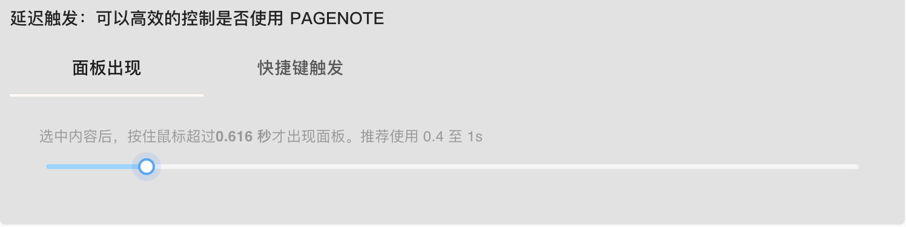

# 长按唤起

如果你有以下烦恼，你需要使用**长按唤起**功能

* 选中一段文本，PAGENOTE 面板就出现，让人有点烦？
* 选中一段文本，无意按下一个键盘，触发了 PAGENOTE 快捷键，让人有点烦？

### 使用方法

选中一段文本后，不要立即释放鼠标，长按一段时间（可配置）后，面板才会出现；同理，按下键盘，不要立即释放，长按一段时间才会触发快捷键。

### 长按时长配置

前往 [https://pagenote.logike.cn/me\#/setting/extension](https://pagenote.logike.cn/me#/setting/extension) 配置

